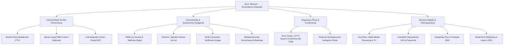

# Manual Geral de Produtos, Serviços & Matriz de Combos — Nuvv Telecom

> **Classificação:** Documento Estratégico & Operacional Unificado (B2C / B2B)  
> **Público-Alvo do Documento:** Consultores de Vendas, Televendas, Gerentes de Contas, Suporte Técnico N1/N2 e Operações  
> **Versão:** 1.0 (Setembro/2026)

---

## 1. Visão Geral do Ecossistema Nuvv

A **Nuvv Telecom** não é apenas uma provedora de acesso à internet. A Nuvv é uma **plataforma de tecnologia, infraestrutura e serviços conectados**, posicionando-se como parceira estratégica para famílias, comércios, empresas e condomínios.



---

## 2. Índice dos Manuais Específicos por Produto

Para instruções aprofundadas, argumentos de venda, roteiros de suporte e checklists de contratação detalhados, consulte os manuais dedicados da pasta:

1. 📄 [**01. Internet Fibra Residencial & Combos de Entretenimento / Saúde**](file:///c:/Dev/Nuvv%20Site/docs/manual-produtos/01-internet-fibra-residencial.md)
2. 📄 [**02. Conectividade Corporativa (Banda Larga PME, Semi-Dedicado & Link Dedicado)**](file:///c:/Dev/Nuvv%20Site/docs/manual-produtos/02-internet-empresarial-link.md)
3. 📄 [**03. Telefonia Digital & PABX em Nuvem (Cloud PBX & Tronco SIP)**](file:///c:/Dev/Nuvv%20Site/docs/manual-produtos/03-telefonia-pabx-em-nuvem.md)
4. 📄 [**04. Comunicação Avançada (Voice AI & RCS Corporativo Verificado)**](file:///c:/Dev/Nuvv%20Site/docs/manual-produtos/04-comunicacao-avancada-voice-ai-rcs.md)
5. 📄 [**05. Multiatendimento Omnichannel (WhatsApp Multiagente, IA & CRM Kanban)**](file:///c:/Dev/Nuvv%20Site/docs/manual-produtos/05-multiatendimento-omnichannel.md)
6. 📄 [**06. Social Wi-Fi Marketing (Hotspot Social, Captura de Leads & Fidelização)**](file:///c:/Dev/Nuvv%20Site/docs/manual-produtos/06-social-wifi-marketing.md)
7. 📄 [**07. Nuvv Guard (Segurança Condominial, CFTV Nuvem & Interfone Virtual)**](file:///c:/Dev/Nuvv%20Site/docs/manual-produtos/07-nuvv-guard-seguranca-condominial.md)
8. 📄 [**08. Poste de Monitoramento Inteligente (Nuvv Vision Urbano & Perimetral)**](file:///c:/Dev/Nuvv%20Site/docs/manual-produtos/08-poste-monitoramento-inteligente.md)
9. 📄 [**09. Segurança Digital & Endpoint (Kaspersky Plus, Safe Kids & Proteção DNS)**](file:///c:/Dev/Nuvv%20Site/docs/manual-produtos/09-seguranca-digital-kaspersky.md)

---

## 3. Matriz de Produtos vs. Segmentos de Mercado

Esta matriz orienta a equipe comercial a identificar rapidamente **o que oferecer** conforme o perfil do cliente:

| Produto / Solução | Residencial & Famílias | Comércio & Varejo | Escritórios & PMEs | Médias & Grandes Empresas | Condomínios & Vilas |
| :--- | :---: | :---: | :---: | :---: | :---: |
| **Fibra Residencial (400M / 800M)** | ⭐ **Core** | — | — | — | — |
| **NuvvPlay / TV / Streaming** | ⭐ **Core** | TV Notícias/Esporte | TV Recepção | — | — |
| **TurboMed Telemedicina** | ⭐ **Essencial** | Benefício Pessoal | Benefício Equipe | — | — |
| **Banda Larga PME (400M a 1G)** | — | ⭐ **Core** | ⭐ **Core** | — | Conectividade Guarita |
| **Semi-Dedicado (IP Fixo)** | Home Office Avançado | Câmeras / PDV | ⭐ **Core** | Filiais / Backup | CFTV Condominial |
| **Link Dedicado Carrier-Grade** | — | — | Servidores Próprios | ⭐ **Core** | — |
| **PABX em Nuvem** | — | Delivery / Pedidos | ⭐ **Core** | Call Centers | Portaria / Ramais |
| **Voice AI & RCS** | — | Cobrança / Promoção | Confirmação Agenda | ⭐ **Escala** | Avisos de Assembleia |
| **Multiatendimento WhatsApp** | — | ⭐ **Vendas** | ⭐ **Atendimento** | SAC Corporativo | Atendimento Síndico |
| **Social Wi-Fi Marketing** | — | ⭐ **Essencial** | Recepção | Eventos / Salões | Áreas de Lazer |
| **Nuvv Guard (CFTV/Interfone)** | Sobrados / Casas | Lojas | Estoque | — | ⭐ **Principal** |
| **Poste Nuvv Vision** | — | Corredor Comercial | Perímetro de Carga | Perímetro Fabril | ⭐ **Principal** |
| **Kaspersky & Cibersegurança** | ⭐ **Proteção Pais** | PDVs / Caixas | Computadores / TI | Servidores | — |

---

## 4. Estratégia de Combos (Cross-Sell & Up-Sell)

### 4.1. Regras de Combos Residenciais
* **Base de Velocidade:** O cliente escolhe 400 Mega (Base) ou 800 Mega (+ R$ 30,00/mês).
* **Camada de Entretenimento (Grade Watch / NuvvPlay):**
  * *Básico:* + R$ 9,90/mês (28 canais + Awdio + Sony One + Universal+)
  * *Essencial:* + R$ 29,90/mês (68 canais com Canais Globo)
  * *Completo:* + R$ 59,90/mês (93 canais com Premiere e Combate inclusos)
  * *Add-on Telecine Promocional:* + R$ 10,00/mês
  * *Add-on HBO Max Promocional:* + R$ 20,00/mês
* **Add-ons de Família & Casa:**
  * *TurboMed Telemedicina 24h:* Individual R$ 9,90 | Familiar R$ 19,90
  * *Kaspersky Proteção Digital:* 5 aparelhos R$ 9,90 | 10 aparelhos R$ 15,90
  * *Interfone Virtual QR Code:* Taxa única R$ 79,90 e **mensalidade R$ 0,00** para assinante Nuvv.

### 4.2. Estratégia "Monte Seu Combo Empresarial"
Para empresas, a venda nunca deve ser apenas um link de internet. O consultor deve montar a solução sob medida somando os módulos essenciais:

$$\text{Combo Empresarial} = \text{Conectividade (PME ou Semi)} + \text{PABX em Nuvem} + \text{Multiatendimento WhatsApp} + \text{Social Wi-Fi}$$

* **Exemplo de Combo PME de Alto Sucesso Comercial:**
  1. *Banda Larga Empresa Plus 800 Mega:* R$ 129,90/mês
  2. *PABX em Nuvem 5 Ramais com URA e Gravação:* R$ 129,90/mês
  3. *Multiatendimento WhatsApp Pro (até 10 atendentes + IA):* R$ 299,90/mês
  4. *Social Wi-Fi 50 Acessos (Captura de Leads e Google Review):* R$ 59,90/mês
  * **Valor Total Consolidado:** R$ 619,60/mês.
  * **Proposta de Valor:** A empresa moderniza toda a infraestrutura de comunicação, resolve o atendimento no WhatsApp, coloca Wi-Fi seguro para clientes e ganha velocidade com suporte local em uma única fatura.

---

## 5. Tabela Consolidada de Preços & Referências ERP Hubsoft

| Produto / Serviço | Referência Comercial | Código Interno ERP | Preço Promocional | Preço de Tabela |
| :--- | :--- | :--- | :--- | :--- |
| **Fibra 400 Mega Residencial** | Só Fibra 400M | `FIBRA_400` | R$ 99,90 | R$ 119,90 |
| **Fibra 800 Mega Residencial** | Só Fibra 800M | `FIBRA_800` | R$ 129,90 | R$ 149,90 |
| **Combo Básico** | Hub Play Local Pro | `HUB_PLAY_PRO` | R$ 109,80 | R$ 129,90 |
| **Combo Básico + Telecine** | Hub Ultra Local Pro | `HUB_ULTRA_PRO` | R$ 119,80 | R$ 139,90 |
| **Combo Essencial (Globo)** | Power Play | `POWER_PLAY` | R$ 129,80 | R$ 149,90 |
| **Combo Essencial + Telecine** | Watch Black Premium | `WATCH_BLACK_PREM`| R$ 139,80 | R$ 159,90 |
| **Combo Essencial + HBO Max** | Watch Black Power Play | `WATCH_BLACK_PWR` | R$ 149,80 | R$ 169,90 |
| **Combo Completo (Premiere/Combate)**| Power Seleção Esportes | `POWER_SELECAO` | R$ 159,80 | R$ 179,90 |
| **Combo Completo + Telecine** | Power Elite WBD | `POWER_ELITE` | R$ 169,80 | R$ 189,90 |
| **Completão Família (Tudo)** | Power Elite + Max | `COMPLETAO_FAM` | R$ 189,80 | R$ 209,90 |
| **Telemedicina Individual** | TurboMed Essencial Ind | `TURBOMED_IND` | R$ 9,90 | R$ 14,90 |
| **Telemedicina Familiar** | TurboMed Essencial Fam | `TURBOMED_FAM` | R$ 19,90 | R$ 29,90 |
| **Kaspersky Família (5 disp.)** | Proteção Família | `SAFE_5` | R$ 9,90 | R$ 19,90 |
| **Kaspersky Plus (10 disp. + VPN)**| Proteção Família Plus | `SAFE_PLUS_10` | R$ 15,90 | R$ 29,90 |
| **Empresa Start 400 Mega** | Banda Larga PME | `BIZ_START_400` | R$ 99,90 | R$ 119,90 |
| **Empresa Plus 800 Mega** | Banda Larga PME | `BIZ_PLUS_800` | R$ 129,90 | R$ 149,90 |
| **Empresa Max 1 Giga** | Banda Larga PME | `BIZ_MAX_1000` | R$ 189,90 | R$ 209,90 |
| **Semi-Dedicado 300 Mega (IP Fixo)**| Semi-Dedicado 300M | `SEMI_300` | R$ 199,90 | R$ 219,90 |
| **Semi-Dedicado 500 Mega (IP Fixo)**| Semi-Dedicado 500M | `SEMI_500` | R$ 259,90 | R$ 279,90 |
| **Semi-Dedicado 700 Mega (IP Fixo)**| Semi-Dedicado 700M | `SEMI_700` | R$ 399,90 | R$ 419,90 |
| **PABX em Nuvem (2 Ramais)** | Cloud PBX 2 | `PABX_2` | R$ 59,90 | R$ 79,90 |
| **PABX em Nuvem (5 Ramais)** | Cloud PBX 5 | `PABX_5` | R$ 129,90 | R$ 159,90 |
| **PABX em Nuvem (10 Ramais)** | Cloud PBX 10 | `PABX_10` | R$ 249,90 | R$ 299,90 |
| **Multiatendimento Essencial (3 users)**| WhatsApp Multiagente | `MULTI_ESSENCIAL`| R$ 149,90 | R$ 189,90 |
| **Multiatendimento Pro (10 users + IA)**| WhatsApp Multiagente Pro| `MULTI_PRO` | R$ 299,90 | R$ 359,90 |
| **Social Wi-Fi 10 Acessos** | Hotspot Social 10 | `HOTSPOT_10` | R$ 39,90 | R$ 49,90 |
| **Social Wi-Fi 50 Acessos** | Hotspot Social 50 | `HOTSPOT_50` | R$ 59,90 | R$ 79,90 |
| **Social Wi-Fi 100 Acessos** | Hotspot Social 100 | `HOTSPOT_100` | R$ 89,90 | R$ 119,90 |
| **Nuvv Guard Câmera 7D (Comodato)** | Câmera Nuvem 7 Dias | `GUARD_CAM_7D` | R$ 44,90 | R$ 54,90 |
| **Nuvv Guard Câmera 7D (BYOD)** | Nuvem Câmera Própria | `GUARD_BYOD_7D` | R$ 19,90 | R$ 29,90 |
| **Interfone Virtual QR Code** | Interfone Nuvv Guard | `GUARD_INTERCOM` | R$ 79,90 (Única) | R$ 120,00 |
| **Poste Nuvv Vision Standard** | Poste Urbano Standard | `POSTE_VISION_STD`| R$ 299,00 | R$ 350,00 |

---

## 6. Fluxo Integrado de Atendimento e Suporte Técnico

Para garantir a melhor experiência e cumprimento dos prazos contratuais de SLA, os chamados de suporte técnico são escalonados da seguinte forma:

```
[Cliente Nuvv (WhatsApp / Telefone / App)]
                 │
                 ▼
     ┌───────────────────────┐
     │  Nível 1 (N1) - SAC   │ ➔ Triagem rápida, teste de atenuação OLT,
     │  Atendimento Humano   │   redefinição de senhas e teste de roteador.
     └───────────┬───────────┘
                 │ (Não resolvido em 15 min / Rompimento de Fibra)
                 ▼
     ┌───────────────────────┐
     │  Nível 2 (N2) - NOC   │ ➔ Análise de rotas BGP, regras de firewall,
     │  Engenharia de Redes  │   QoS de voz, servidores VoIP e PABX Cloud.
     └───────────┬───────────┘
                 │ (Falha física externa / Troca de equipamento)
                 ▼
     ┌───────────────────────┐
     │  Equipe de Campo      │ ➔ Técnicos de fibra com máquina de fusão,
     │  Instalação & Reparo  │   reparo de drops ópticos e substituição de ONUs.
     └───────────────────────┘
```

### Níveis de SLA Contratual
* **Residencial:** Reparo em até 24h a 48h úteis.
* **Banda Larga PME:** Reparo prioritário em até 24h a 48h contínuas.
* **Semi-Dedicado (IP Fixo):** Reparo em até **12 horas contínuas**.
* **Link Dedicado Enterprise:** Reparo em até **4 horas contínuas (24/7/365)** com monitoramento proativo em tempo real pelo NOC.
